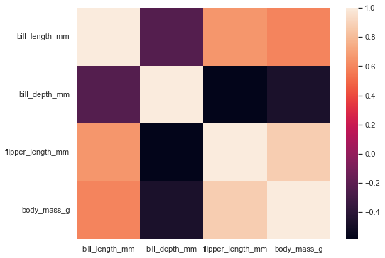
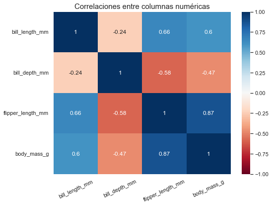
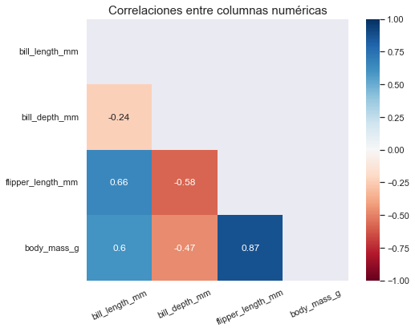

En este pequeño tutorial revisaremos cómo crear una mapa de calor de una matriz de correlaciones en Python usando la librería `seaborn` (Interfaz por funciones). Lo primero que haremos será importar la librería `seaborn`, además utilizaremos la librería `numpy` para crear un *mask* que utilizaremos más adelante.

```python
# Importar las librerías
import seaborn as sns
import numpy as np

# Establecer un tamaño a las figuras de seaborn
sns.set(rc={'figure.figsize':(8, 6)})
```

## Explorar dataset

En este ejemplo utilizaremos el dataset "penguins" el cual se puede importar desde `seaborn` con la función <code>sns.load_dataset("<i>dataset-name</i>")</code> cuyo argumento es el nombre del dataset. Los nombres de los datasets disponibles se pueden obtener con la función `sns.get_dataset_names()`.

```python
# Importar y almacenar el dataset "penguins"
penguins = sns.load_dataset("penguins")
```

El dataset "penguins" contiene información sobre 3 especies de pingüinos en la Antartida recolectada por el Dr. Kristen Gorman. La función `sns.load_dataset("penguins")` retorna un objeto `pandas.DataFrame`, para fines de este tutorial se supondrá que el lector ya está familiarizado con la librería `pandas`. Revisemos las primeras filas del dataset.

```python
# Imprimir las primeras 5 filas del dataset.
penguins.head()
```



Para obtener más información acerca del dataset utilizaremos el método `DataFrame.info()` para imprimir un pequeño resumen sobre las columnas del dataframe

```python
penguins.info()
```

```
<class 'pandas.core.frame.DataFrame'>
RangeIndex: 344 entries, 0 to 343
Data columns (total 7 columns):
 #   Column             Non-Null Count  Dtype  
---  ------             --------------  -----  
 0   species            344 non-null    object 
 1   island             344 non-null    object 
 2   bill_length_mm     342 non-null    float64
 3   bill_depth_mm      342 non-null    float64
 4   flipper_length_mm  342 non-null    float64
 5   body_mass_g        342 non-null    float64
 6   sex                333 non-null    object 
dtypes: float64(4), object(3)
memory usage: 18.9+ KB


None
```

Como se puede observar el dataset consta de 7 columnas y 344 filas. Para fines de este tutorial únicamente nos interesa las columnas numéricas por lo que se procederá a filtrar el dataset solo para las columnas numéricas con el método `DataFrame.select_dtypes()`. Además podemos observar que algunas filas tienen valores perdidos por lo que que se procederá a eliminar estas filas con el método `DataFrame.dropna()`

```python
# Selecccionar solo columnas numéricas y eliminar filas con valores perdidos
penguins_num = (penguins
                    .select_dtypes(include="float")
                    .dropna(axis=0))

# Volver a imprimir la información del dataset
penguins_num.info()
```

```
<class 'pandas.core.frame.DataFrame'>
Int64Index: 342 entries, 0 to 343
Data columns (total 4 columns):
 #   Column             Non-Null Count  Dtype  
---  ------             --------------  -----  
 0   bill_length_mm     342 non-null    float64
 1   bill_depth_mm      342 non-null    float64
 2   flipper_length_mm  342 non-null    float64
 3   body_mass_g        342 non-null    float64
dtypes: float64(4)
memory usage: 13.4 KB
```

## Calcular matriz de correlaciones

Ahora que el dataset ya tiene únicamente columnas numéricas obtendremos su matriz de correlaciones. Una matriz de correlaciones nos informa sobre la correlación que existe entre las columnas numéricas de datos tabulares. Para ello utilizaremos el método `DataFrame.corr()`.

> **Nota**: No es necesario que el dataframe tenga solo columnas numéricas para aplicar el método `df.corr()`. Si se aplica en un dataframe que tiene varios tipos de columnas el método solo se aplicará a las columnas numéricas. En este tutorial se filtró solo para columnas numéricas para mayor claridad.

```python
# Calcular la matriz de correlaciones
corr_matrix = penguins_num.corr()
```

Una vez calcula la matriz de correlaciones podemos imprimirla para visualizar los valores

> **Nota**: Este tutorial de creó en *Jupyter Notebook*, por ello se utiliza la función `display()` en lugar de `print()`.

```python
display(corr_matrix)
```



## Graficar mapa de calor

Aunque con la matriz de correlaciones podemos sacar conclusiones acerca de cómo se correlacionan las columnas del dataset, puede resultar más sencillo visualizar los resultados con un mapa de calor, particularmente en datasets más grandes. Para crear un mapa de calor utilizaremos la función `seaborn.heatmap()` cuyo argumento será la matriz de correlaciones que obtuvimos anteriormente

> **Nota**: El resultado de la función `seaborn.heatmap()` se asignó a la variable `_` para evitar que se imprima el resultado de `seaborn.heatmap()` que no es útil en este caso.

```python
# Graficar el mapa de calor de corr_matrix
_ = sns.heatmap(corr_matrix)
```



## Personalización del mapa de calor

El único argumento obligatorio de la función `sns.heatmap()` es la matriz de correlaciones, pero existen muchos otros argumentos para facilitar la interpretación de la gráfica. Para una lista complete de parámetros de la función visitar la [documentación de sns.heatmap](https://seaborn.pydata.org/generated/seaborn.heatmap.html). A continuación revisaremos algunos de los más importantes:

* `vmin`: Valor mínimo de la barra de color. 
* `vmax`: Valor máximo de la barra de color.
* `cmap`: Paleta de colores a usar para la gráfica. Existen diversas formas como se puede definir pero una de las más sencillas es utilizar una paleta de colores divergente predefinida como las de [Matplotlib](https://matplotlib.org/cheatsheets/_images/cheatsheets-2.png).
* `center`: Valor intermedio de la barra de color.
* `annot`: Valor booleano (`True` o `False`) para indicar si imprimir el valor de cada celda en el mapa de calor.

Además de agregar los argumentos anteriormente explicados también agregaremos un título a la gráfica y rotaremos los "*ticks*" del eje x $25^o$. Para ello tener en cuenta que la función `sns.heatmap` retorna un objeto `Axes` de `matplotlib`, por lo tanto cualquier método se `matplotlib.Axes` se puede usar en el objeto retornado por la función

```python
# Graficar mapa de calor
ax = sns.heatmap(corr_matrix,
            # Paleta de colores
            cmap="RdBu",
            # Valor máximo de la barra de color
            vmax=1,
            # Valor mínimo de la barra de color
            vmin=-1,
            # Valor intermedio de la barra de color
            center=0,
            # Para indicar que imprima el valor de cada celda
            annot=True)

# Rotar los tick del eje x
ax.xaxis.set_tick_params(rotation=25)

# Agregar un título a la gráfica
_ = ax.set_title("Correlaciones entre columnas numéricas", size=15)
```



Con las modificaciones hechas es mucho más sencillo comprender las correlaciones entre las columnas del dataset. Por ejemplo, podemos observar que `body_mass_g` y `flipper_lenght_mm` son las columnas con una correlación positiva más alta y que `flipper_lenght_mm` y `bill_depth_mm` son las columnas con una correlación negativa más alta.

Una matriz de correlaciones es simétrica con respecto a la diagonal y por consiguiente su gráfica también lo es. Si se desea graficar solo los valores por encima o por debajo de la diagonal se debe de agregar un *mask*. Un mask, en este caso, es una matriz de valores booleanos que indican cuáles celdas incluir en la gráfica. Las celdas con valores `True` **no** serán mostradas en la gráfica.

Para crear un mask utilizaremos las funciones `np.triu` y `np.ones_like`:

* `np.ones_like`: Es una función que crea una matriz con las mismas dimensiones que otra matriz y cuyos valores serán todos 1s.
* `np.triu`: Es una función que extrae la matriz triangular superior de una matriz existente. Alternativamente se podría usar la función `np.tril` que extrae la matriz triangular inferior.

Con esas dos funciones crearemos una matriz del mismo tamaño que `corr_matrix` cuyos valores serán todos unos. Como las celdas con `True` serán ignoradas por `sns.heatmap()` entonces extraeremos la matriz triangular superior para que estas celdas no sean mostradas en la gráfica. Los valores por debajo de la diagonal tomarán de valor de `False` por lo que sí serán mostradas en la gráfica. 

```python
# Creando el mask
mask = np.triu(np.ones_like(corr_matrix, dtype=bool))
```

Con el mask definido procederemos a utilizarlo en la función en el parámetro `mask`. 

```python
# Incluir el mask en la función 
ax = sns.heatmap(corr_matrix,
            cmap="RdBu",
            vmax=1,
            vmin=-1,
            center=0,
            annot=True,
            square=True,
            mask=mask)

ax.xaxis.set_tick_params(rotation=25)
_ = ax.set_title("Correlaciones entre columnas numéricas", size=15)
```



De esta forma obtener una matriz más limpia que permite analizar mejor las correlaciones entre las columnas del dataset, lo cual puede ser de mucha utilidad en datasets más grandes.